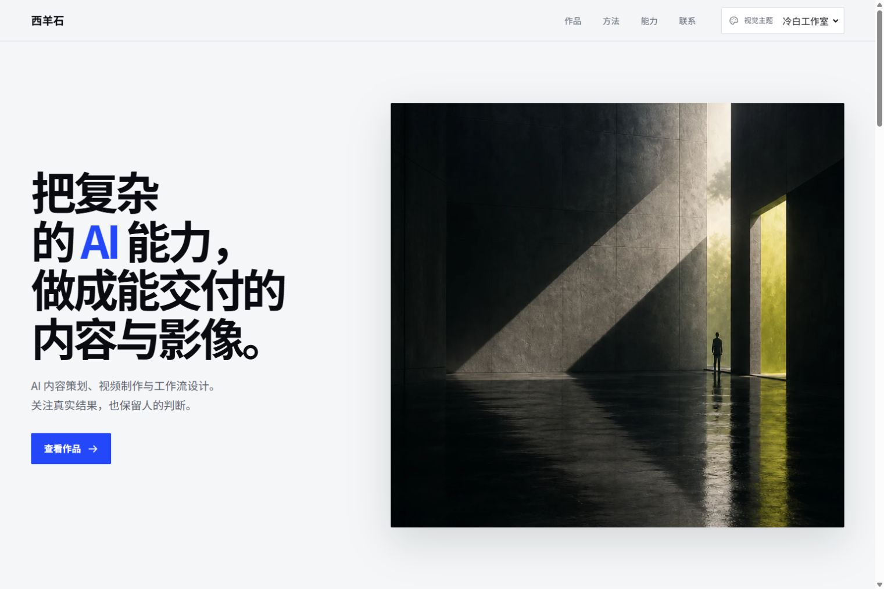
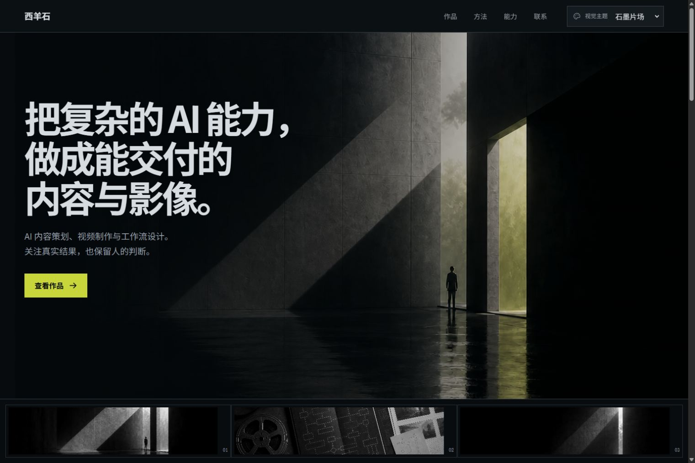
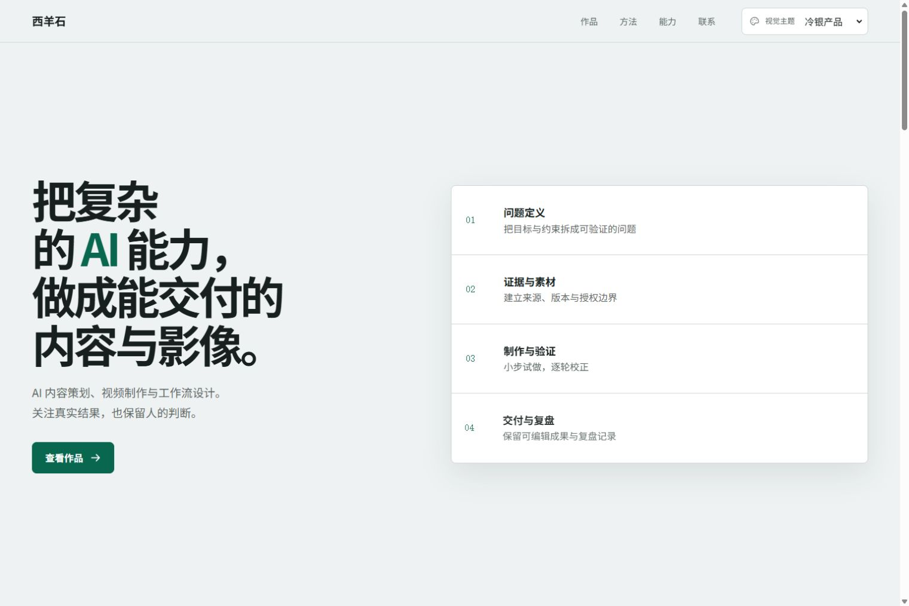

# 低门槛求职作品集模板

这是一个面向文科生、内容岗位和近期求职者的开源中文作品集模板。默认展示“西羊石AI视频”示例档案，Fork 后只需要集中修改一个文件，就能换成自己的简历与项目。

不需要先学 React。你可以直接在 GitHub 网页上改文字，再交给 Vercel 自动部署。

## 四套职业主题

同一份项目内容可以切换四种构图。Studio 面向设计与创意，Cinema 面向影视与动效，Product 面向产品与研究，Editorial 面向内容、品牌和运营。

| Studio | Cinema |
| --- | --- |
|  |  |

| Product | Editorial |
| --- | --- |
|  |  |

手机端预览在 `docs/previews/`。四套主题都有独立首屏、项目组织、流程表达和标志动效，切换视觉主题不会改写项目事实或职业叙事标签。

## 先看这三个原则

1. 唯一需要优先编辑的文件是 `src/content/profile.ts`。
2. 没有确认的内容保留 `null`，页面会自动隐藏，不要填示例姓名、假邮箱或估算数据。
3. 项目存在不代表素材可以公开。图片、成片、客户资料和数据都要单独确认授权。

## 10 分钟上手，不用命令行

### 第一步：Fork 项目

登录 GitHub，在仓库右上角点击 **Fork**，把项目复制到自己的账号。

### 第二步：只改一个内容文件

在自己的仓库中打开 `src/content/profile.ts`，点击右上角铅笔图标。按文件里的 `EDIT HERE 1` 到 `EDIT HERE 9` 依次修改：

- 职业叙事预设与视觉主题
- 品牌名和页面显示名
- 真实姓名、目标岗位、教育与工作经历
- 首屏介绍
- 三个项目
- 工作方法与能力
- 简历路径
- 联系方式
- SEO 描述与正式域名

修改完成后点击 **Commit changes**。第一次使用时，直接覆盖三个示例项目最省事，不需要增加或删除代码块。

### 第三步：部署到 Vercel

[](https://vercel.com/new)

1. 点击上方按钮，用 GitHub 登录 Vercel。
2. 选择刚刚 Fork 的仓库。
3. 如果仓库中还有其他目录，将 Root Directory 设为 `portfolio-site`。
4. Framework Preset 选择 Vite，Build Command 使用 `npm run build`，Output Directory 使用 `dist`。
5. 点击 Deploy，等待预览地址生成。

以后每次在 GitHub 提交修改，Vercel 都会自动重新部署。

## 非技术用户怎么填写

如果还不知道该选哪些项目，先看 [按岗位填写求职作品集](docs/role-profile-guide.md)。里面按设计、影视、产品和内容运营四组岗位整理了项目选择、证据、无数据写法和可复制的首屏句式。

### `null` 是安全开关

`null` 表示这项资料还没确认，站点会把它标记为 `pending` 并隐藏。确认后再替换为真实内容。

不要把 `null` 改成空格、`待补充`、示例邮箱或虚构数字。这样虽然页面可能显示出来，但会让面试官误以为它是真实信息。

### 选择职业预设与主题

`profile.ts` 顶部只有两个选择项：

- `careerPreset` 控制项目详情使用什么叙事标签。
- `theme` 控制整站颜色、字体、圆角、阴影、版式与动效方向。

两者都只能使用以下四个值，也可以独立混搭：

| 值 | 适合岗位 | 项目叙事标签 | 视觉方向 |
| --- | --- | --- | --- |
| `studio` | 设计师、创意岗位、自由职业者 | Brief / My role / System / Outcome | 冷白、近黑、ultramarine、kinetic typography |
| `cinema` | 导演、剪辑、制片、视频内容 | Treatment / Credits / Cut / Delivery | graphite、silver、chartreuse、frame wipe |
| `product` | 产品经理、用户研究、项目岗位 | Context / Decision / Tradeoff / Impact | cool silver、charcoal、deep emerald、decision path |
| `editorial` | 内容、品牌、市场、运营 | Goal / Strategy / Execution / Result | true paper white、ink、burnt orange、page mask |

例如，产品经理可以同时选择 `careerPreset: 'product'` 与 `theme: 'product'`。内容运营也可以使用 `careerPreset: 'editorial'` 搭配更克制的 `theme: 'studio'`。只替换引号内的一个词，不要改字段名。

四套主题都使用中文友好的字体回退栈，并避免把 Inter 作为默认首选。影视主题使用现代 sans，编辑主题的标题优先使用 Source Serif 4 或 Noto Serif SC。

编辑主题随项目打包 Noto Serif SC Variable，离线和国内网络环境不需要再请求远程字体。字体继续使用 SIL Open Font License 1.1，许可证副本见 `public/licenses/noto-serif-sc-OFL.txt`，第三方说明见 `THIRD_PARTY_NOTICES.md`。

### 品牌一处修改，全站生效

在 `profile.ts` 顶部修改 `identity`：

- `name`：完整品牌名或你的姓名
- `displayName`：页眉使用的短名称
- `descriptor`：一句简短的英文或中文定位

页眉、页脚、SEO 标题和 OG 图片说明都从这里派生，不需要在组件中重复搜索替换。

### 个人资料

真实姓名、目标岗位、教育经历、工作经历和量化成果默认都是 `null`。只写能核验的内容。教育和工作经历中的单位、岗位、时间要与简历保持一致。

### 项目填写顺序

每个项目优先改这五项：

1. `title`：项目名称。
2. `category`：项目类型，例如内容策划、品牌运营、用户研究。
3. `summary`：一句话说明问题、做法和当前结果。
4. `role`：你实际负责的部分，不要把团队成果全部写成个人成果。
5. `deliverables`：真实交付物，例如方案、文章、视频、报告或活动页面。

其余字段：

- `evidence`：能证明过程或交付已经发生的记录。
- `outcome`：最终采用、反馈或业务结果，未确认就保留 `null`。
- `metrics`：数字必须写清来源、统计口径和观察窗口，未核验就保留 `null`。
- `detailsVerified`：项目文字经过核验后再设为 `true`。
- `publicationApproved`：图片、成片和过程资料确认可公开后才设为 `true`，否则保留 `null`。
- `media`：只放已经获准公开的图片路径。未授权时保持空数组。

### 联系方式

邮箱、微信和 GitHub 都有 `value` 与 `href`：

- `value` 是页面显示的真实文字。
- `href` 是点击后打开的完整链接。

两者没有同时确认时，联系按钮不会出现，页面只显示安全提示。不要为了让按钮可见而填写假邮箱。

### 简历 PDF

1. 检查简历中是否含有不准备公开的手机号、住址、身份证信息或证件照。
2. 将确认可公开的文件命名为 `resume.pdf`。
3. 放入 `public/resume/resume.pdf`。
4. 把 `profile.ts` 中的 `resumePath` 从 `null` 改为 `/resume/resume.pdf`。
5. 部署后实际点击下载，确认文件内容和文件名。

简历不存在时，下载入口自动隐藏。

## 图片替换

通用主视觉放在 `public/media`。默认三张抽象图片不含个人信息，可以直接作为模板背景：

- `hero-architecture.webp`
- `workflow-still-life.webp`
- `contact-light-seam.webp`

自己的项目图片也可以放入 `public/media`，但只有在项目的 `publicationApproved` 为 `true` 且 `media` 中写入路径后，内容模型才允许页面消费。

不要上传含有以下内容的图片：

- 身份证、手机号、住址、私人二维码
- 客户后台、聊天记录、未脱敏表格
- 未授权肖像、赛事转播画面、商标或付费素材
- 第三方账号、访问 Token、API Key、内部链接

## 本地启动，可选

如果愿意使用命令行，建议 Node.js 20 或更高版本：

```powershell
npm install
npm run dev
```

上线前检查：

```powershell
npm run lint
npm run build
npm run preview
```

## 内容状态如何工作

`src/content/profile.ts` 是低门槛编辑层，使用真实内容或 `null`。`src/content/portfolio.ts` 会把这些值转换成强类型的 `verified` 或 `pending` 字段，组件只能展示经过核验的数据。

- `verified`：`value` 中保存可以展示的数据。
- `pending`：`value` 固定为 `null`，并附带内部填写提示。

完整待补状态在 `docs/content-status.md`。模板开发者可以查看类型定义 `src/types/portfolio.ts`。

## SEO 与域名

正式域名确定前，`profile.ts` 中的 `seo.siteUrl` 保持 `null`，不能填写示例域名。Vercel 正式域名确认后：

1. 填写完整的 `https://` 地址。
2. 检查页面标题、描述、canonical URL 和 OG 分享图。
3. 如需 sitemap，生成后再把正式地址加入 `public/robots.txt`。

## 上线前隐私与真实性检查

- [ ] 已删掉不属于自己的示例项目和示例经历。
- [ ] 姓名、岗位、学校、单位和时间与简历一致。
- [ ] 邮箱、微信、GitHub 都是本人准备公开的账号。
- [ ] 简历不含不准备公开的手机号、住址、证件信息或私人二维码。
- [ ] 每个数字都有来源、统计口径和观察窗口。
- [ ] 团队成果写清个人职责，没有把团队成绩全部归给自己。
- [ ] 项目名称、客户名称、图片、成片和过程资料都有公开权限。
- [ ] 截图已经遮挡后台账号、聊天对象、访问链接和个人信息。
- [ ] 页面没有假邮箱、示例姓名、虚构公司、空链接或占位数字。
- [ ] 正式域名、分享卡片和搜索描述已经核验。
- [ ] 桌面端与手机端都检查了浏览、键盘操作、链接和下载。
- [ ] `npm run lint` 与 `npm run build` 均通过。

## 部署说明

`vercel.json` 已配置单页应用回退，直接访问页面内路径时会返回 `index.html`。当前模板不需要环境变量，也不应该提交 Vercel Token、邮箱密码或其他密钥。

### GitHub Pages（可选）

仓库根目录的 `.github/workflows/deploy-pages.yml` 会在 `main` 分支更新时自动执行：安装依赖、`lint`、通过 `build:pages` 以 `/<仓库名>/` 为基础路径构建、发布前检查，再部署 `dist`。如果这个模板在单仓库的 `portfolio-site/` 子目录中，工作流也会自动找到它。首次启用时，请在 GitHub 的 **Settings → Pages → Build and deployment** 选择 **GitHub Actions**。

Vercel 不受影响：它仍使用默认根路径 `/` 构建。不要把 Pages 的仓库名路径写死到 `vite.config.ts`。

### 发布前检查

```powershell
npm run build
npm run release:check
```

检查会要求 `public/media` 与构建后的 `dist/media` 都只包含这三张已获准公开的图片，并拒绝 `local-review`、`restricted`、私钥文件和看起来可用的访问令牌进入发布范围。它同时确认 `dist` 含有 `index.html`、`site.webmanifest`、`robots.txt`。教育性文本中的“API Key”等普通字样不会触发检查；仍不要把任何真实密钥写入仓库。
